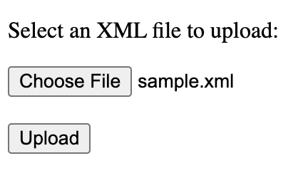
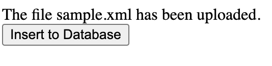
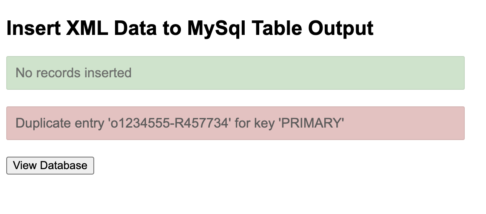
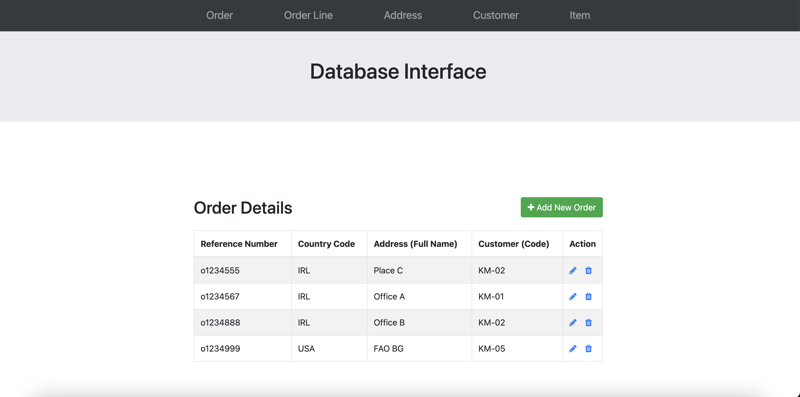
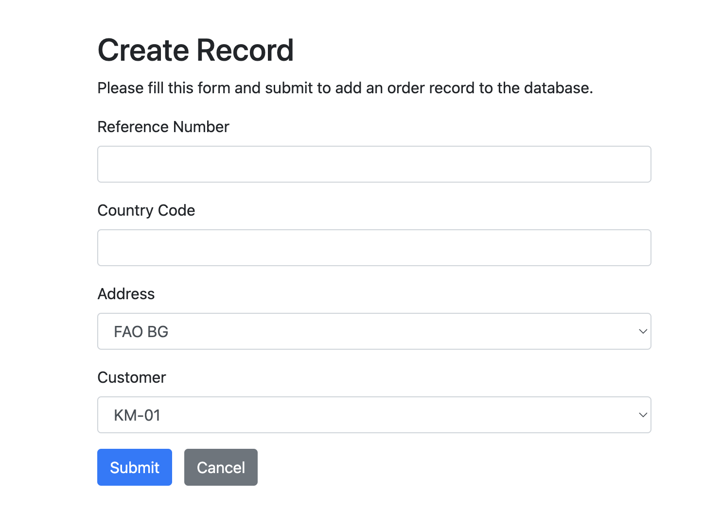
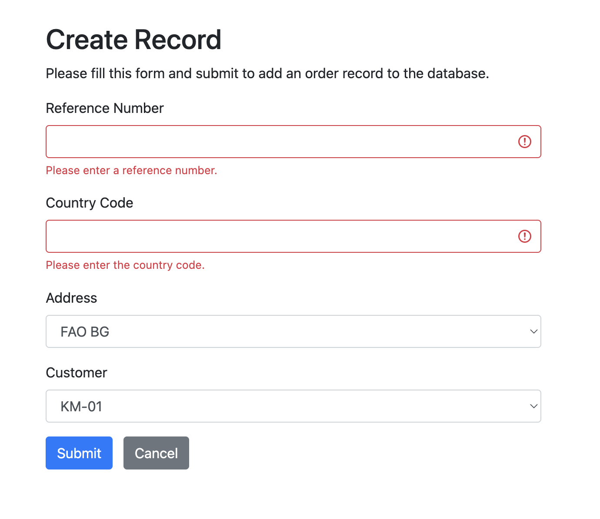
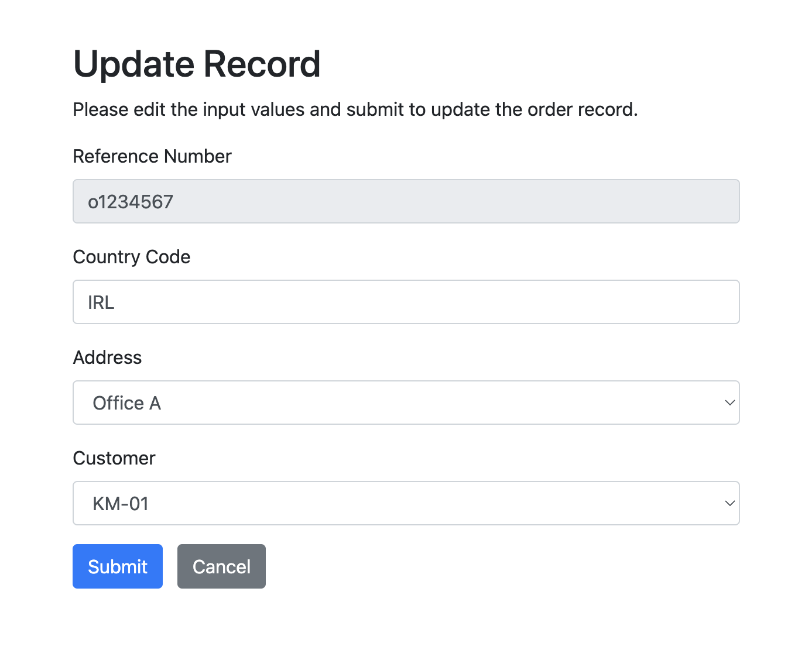
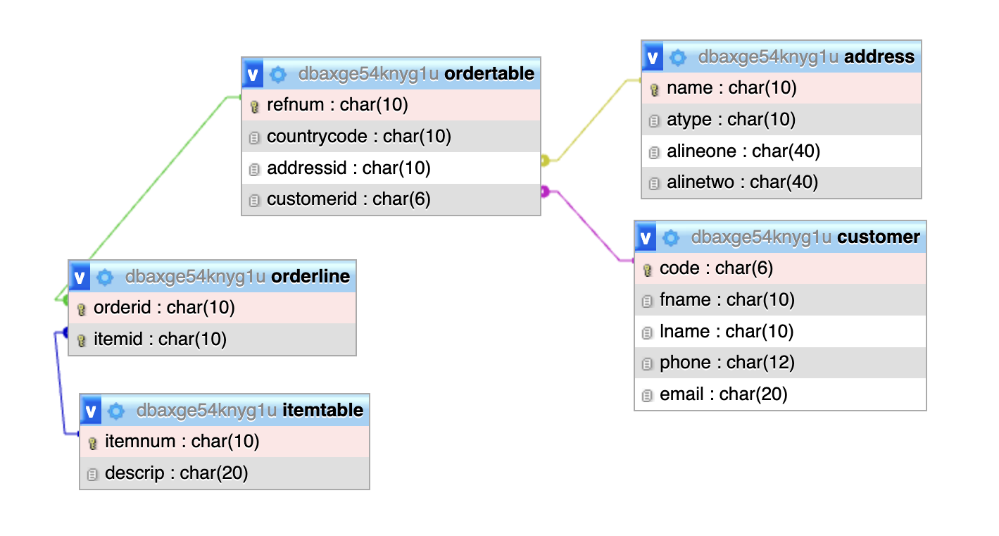

# Database Interface
This project is a responsive personal website to introduce myself and showcase some of my projects. I made this project to learn Bootstrap and enhance my web development ability.  
Languages/Technologies used:
- PHP
- HTML
- CSS
- JavaScript
- jQuery
- Bootstrap 4
- MySQL 
 

If you want to upload your own XML file, click here: [https://erick.sgedu.site/databaseinterface/upload.html](https://erick.sgedu.site/databaseinterface/upload.html)  
If you want to go straight to the interface, which already has sample data inserted, click here: [https://erick.sgedu.site/databaseinterface/interface.php](https://erick.sgedu.site/databaseinterface/interface.php)  
Challenges:
- Learning PHP
- Interacting with MySQL database

Plan to add:
- Search capability
- Less pages to click through
- Add/delete/update on same page
- Make code more modular (like create/update php files)
- Update pages in a different way

## Contents:
- [How to upload XML file](#how-to-upload-xml-file)
- [How to use interface](#how-to-use-interface)
- [Database Design](#database-design)
- [Folder and File Descriptions](#folder-and-file-descriptions)

## How to upload XML file:
1. Click 'Choose File' and select the XML file you want to upload, and press upload.  
 

2a. If the file name is already taken in the server, it will give you this error. Try to name the file something else and go back to [https://erick.sgedu.site/databaseinterface/upload.html](https://erick.sgedu.site/databaseinterface/upload.html).  
 

2b. If the file is successfully uploaded, this will be displayed. Press 'Insert to Database' to insert the XML data into the database.  
 

3. If you insert the same data given in the email, this should be the output. It will say how many records have been entered and if there were any errors such as duplicates. Press 'View Database' to go to the actual interface.
 

## How to use interface:
This is the interface. It has a navigation bar to each of the different tables, and for each table, you can:
- [Add a record](#add-a-record)
- [Update a record](#update-a-record)
- [Delete a record](#delete-a-record)

### Add a Record

This is an example page for adding a record (in this case, the order table). If there is an error, such as the primary key already exists, it should display that error at the top. 
Note: To add an order for a specific customer/address, the customer and address need to be registered in the customer and address table first. Similarly, to add an orderline entry to the database, the order reference number and item number need to be registered in their respective tables first. 
Press 'Submit' to enter the data to the database, or press 'Cancel' to go back. It should bring you straight back to the table you were on.

This just shows a working form validation. It ensures all values are not empty when adding or updating a record.

### Update a Record

This is an example page for updating a record (in this case, the order table). The primary key is set to 'readonly'. This is because other table may be dependent on the specific key. 
Note: To update an order to a specific customer/address, the customer and address need to be registered in the customer and address table first. Similarly, to update an orderline entry in the database, the order reference number and item number need to be registered in their respective tables first. 
Press 'Submit' to update the data in the database, or press 'Cancel' to go back. It should bring you straight back to the table you were on.

### Delete a Record

This is an example page for deleting a record. If there is an error, such as deleting a record whose key is still being referenced, it should display that error at the top. 
Press 'Yes' to delete the record from the database, or press 'Cancel' to go back. It should bring you straight back to the table you were on.

## Database Design:

ordertable - Reference Number is the primary key. It references the foreign keys name (address) and code (customer). 
orderline - (Reference Number, Item Number), is the primary key and demonstrates the one to many relationship. This prevents duplicate entries of a reference number buying the same item. It references the foreign keys refnum (ordertable) and itemnum (itemtable). 
address - Full Name is the primary key. 
customer - Customer Code is the primary key. 
itemtable - Item number is the primary key. 
Note: Initially, I created unique integer ID's for each record of every table, but this proved to be uninformative when inserting the data into the tables. So, I made the assumption that each table's name, reference number, or code would be unique. Also, reference numbers and phone numbers tended to not have only integer values, so I made their types char. 

## Folder and File Descriptions:
create folder - PHP scripts for creating a record in the database.  
delete folder - PHP scripts for deleting a record in the database.  
setup - droptable.php/createtable.php were used to drop/create tables in the initial design phase. inserttable.php is used to take the uploaded XML file and insert its data into the actual database.  
update - PHP scripts for updating a record in the database.< br>
config.php - PHP script to connect to the MySQL database.  
error.php - PHP page for errors.  
interface.php - The actual database interface which uses the create, delete, and update folders.  
upload.html - The initial page to upload the XML file.  
upload.php - PHP script to check uploaded file and redirect to inserttable.php.  
