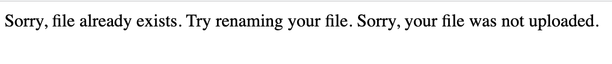

# syncreonfinal
Languages/Technologies used: PHP, HTML, CSS, JavaScript, jQuery, Bootstrap 4, MySQL  
If you want to upload your own XML file, click here: [https://erick.sgedu.site/syncreon/upload.html](https://erick.sgedu.site/syncreon/upload.html)  
If you want to go straight to the interface, which already has the sample data inserted, click here: [https://erick.sgedu.site/syncreon/interface.php](https://erick.sgedu.site/syncreon/interface.php)

## Contents:
- [How to upload XML file](#how-to-upload-xml-file)
- [How to use interface](#how-to-use-interface)
- [Database Design](#database-design)
- [Folder and File Descriptions](#folder-and-file-descriptions)

## How to upload XML file:

## How to use interface:

## Database Design:

Initially I had incorporated ID’s but it didn’t say much information when displayed on data tables
I use rand() to refresh the cache… probably not good

Mysql:
@i2J@#2g#%&d

## Folder and File Descriptions:
